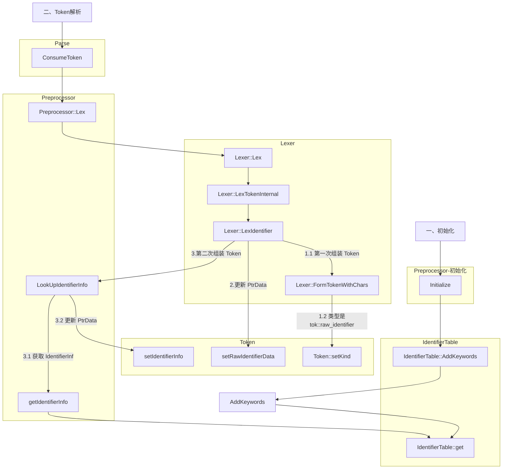

---

title: "clang 源码导读 - 词法分析和预处理"
date: 2021-02-17
categories:
    - 技术
tags:
    - llvm
    - clang
    - 词法分析
    - 预处理
---

[toc]

## Lex 和 Preprocessor

[`clangLex`](https://clang.llvm.org/docs/InternalsManual.html#id26) 是 `clang` 主要负责 **词法分析** 和 **预处理** 的库

本文会通过实际的例子对 `clangLex` 的 **词法分析** 和 **预处理** 流程进行分享

下面是本文涉及到一些重要类型(有删减)

```mermaid
classDiagram
    class DiagnosticsEngine {
        inline clang::DiagnosticBuilder Report(clang::SourceLocation Loc,
                                       unsigned int DiagID)
    }
    class PreprocessorLexer {
    }
    class Lexer {
        const char *BufferPtr;
    }
    PreprocessorLexer <|-- Lexer

    class LangOptions {
    }
    LangOptionsBase <|-- LangOptions
    class Token {
        unsigned Loc
        void *PtrData
        tok::TokenKind Kind;
        unsigned short Flags;
    }
    class Preprocessor {
        IdentifierTable Identifiers;
        LangOptions       &LangOpts;
         DiagnosticsEngine        *Diags;
        std::unique_ptr<PragmaNamespace> PragmaHandlers;
    }
    class IdentifierTable {
        HashTableTy HashTable;
    }
    class IdentifierInfo {
        unsigned TokenID : 9;
        unsigned IsPoisoned : 1;
        unsigned NeedsHandleIdentifier : 1;
        llvm::StringMapEntry<IdentifierInfo *> *Entry = nullptr;
    }
```

[`Token`](https://clang.llvm.org/doxygen/classclang_1_1Token.html#details) 包含了 **词法分析** 后的`token`，它包含诸如 **在源码中的位置**、**类型** 等各类信息

[`Lexer`](https://clang.llvm.org/doxygen/classclang_1_1Lexer.html) 负责将 **文本** 转为 `Token`

[`Preprocessor`](https://clang.llvm.org/doxygen/classclang_1_1Preprocessor.html#details) 是负责与 `Lexer` 进行**预处理**和配合`Lexer` 进行**词法分析**

[`IdentifierTable`](https://clang.llvm.org/doxygen/classclang_1_1IdentifierTable.html) 维护 `string` 与 `IdentifierInfo` 的映射关系，类似于字典

[`IdentifierInfo`](https://clang.llvm.org/doxygen/classclang_1_1IdentifierInfo.html) 记录了 `Token` 的各种重要信息（是否属于编程语言的关键字，是否是函数名、变量名）

> `Token` 与 `IdentifierInfo` 的区别是：`IdentifierInfo` 是经过精简并进行了内存占用优化

[`DiagnosticsEngine`](https://clang.llvm.org/doxygen/classclang_1_1DiagnosticsEngine.html#details) 提供 `issues` 报告的功能

### 词法分析

本节以下面的代码的函数返回值 `void` 为例介绍 **词法分析** 的流程：

```c
void testC() {
}
```

> 本段结束后，会有一个流程图，方便对本节内容理解和记忆

1. `Preprocessor::Initialize` 函数在被初始化调用时，会通过 `IdentifierTable` 的 `AddKeywords` 方法先初始化 **编程语言关键字**

   

   **编程语言关键字** 是指对编程语言有特殊含义的单词。比如，`void` 代表 `空`，是所有 **`c`家族语** 言的 **关键字**
   `TokenKinds.def` 维护了不同编程语言的 **关键字**
   

2. `AddKeyword` 最终会更新 `IdentifierTable` 的内容

   

3. `Parser` 会通过 `Preprocessor::Lex` 调用 `Lexer::Lex` 函数

   

4. `Lexer::Lex` 函数会先通过 `Result.startToken` 函数，准备接收一个新的 `Token`，并做一些预备工作；然后调用 `Lexer::LexTokenInternal` 函数

   

5. `Lexer::LexTokenInternal` 函数会依次解析每个字符，当检测到以字符 `v`开头后，会调用 `Lexer::LexIdentifier` 函数

   

6. `Lexer::LexIdentifier` 函数会先通过 `while 循环` 的方式，将 `CurPtr` 指向 `testC`

   

   随后，会调用 `FormTokenWithChars` 函数更新 `Token`，`Token` 类型是 `tok::raw_identifier`

   

7. `FormTokenWithChars` 函数会更新 `Token` 的**长度**、**位置**、**类型** 信息

   

8. 随后，`LexIdentifier` 函数会调用 `setRawIdentifierData` 更新 `Token` 的 `PtrData` 属性

   更新完成后，就可以通过 `Result.getRawIdentifier().str()` 获取到 `Token` 对应的 **原始字符串**

   > 当 `Token` 是 `tok::raw_identifier` 类型时， `PtrData` 就会指向 **原始字符串**

   

9. 再调用 `Preprocessor` 的 `LookUpIdentifierInfo` 函数更新`Token`的信息

   

10. `LookUpIdentifierInfo` 函数会调用 `getIdentifierInfo` 查找标识信息（参数就是 `void` ）

    

11. `getIdentifierInfo` 会直接转发给 `IdentifierTable::get` 函数进行下一步处理

    

12. `IdentifierTable::get` 会根据名字查找对应 `IdentifierInfo`

    > 因为 `void` 是 **编程语言关键字**，所以，会返回通过 `Identifiers.AddKeywords(LangOpts)` 函数提交 **语言关键字 void**
    > 查找失败，会创建一个新的 `IdentifierInfo` 示例

    

13. 返回 `LookUpIdentifierInfo` 函数后，会根据 `IdentifierInfo` 的信息更新 `Token` ，并返回 `II`

    > `Identifier.setIdentifierInfo(II)` 更新 `PtrData`
    >
    > `Identifier.setKind(II->getTokenID());` 更新 `Kind`

    

14. 至此，`Lexer::LexIdentifier` 函数就完成了将`void` 解析为 `Token` 的使命

    

附 `词法分析` 的流程图：



### 预处理

**预处理** 的过程
本节以 [`#pragma GCC poison`](https://mp.weixin.qq.com/mp/appmsgalbum?action=getalbum&__biz=MzAxMzk0OTg5MQ==&scene=1&album_id=1750332412686843906&count=3#wechat_redirect) 为例，介绍 **预处理** 的过程

> `#pragma clang poison` 是一个预处理指令，可以实现禁止源码中出现某些标识符。
>
> 读者可以尝试在任意源码添加下面的示例片段，看看能否编程成功
>
> 更多相关知识，可以点击这个[链接](https://mp.weixin.qq.com/mp/appmsgalbum?action=getalbum&__biz=MzAxMzk0OTg5MQ==&scene=1&album_id=1750332412686843906&count=3#wechat_redirect)

```objc
#pragma clang poison testC testB

void testC() {
}

void testB() {
    testC();
}
```

### 初始化阶段

1. **预处理器** 初始化时会保存传入的`Diags`，并会创建一个匿名的 `PragmaNamespace`，并调用 `RegisterBuiltinPragmas` 函数

   

2. `RegisterBuiltinPragmas` 函数会生成 `PragmaPoisonHandler` 的实例，并通过函数 `AddPragmaHandler` 进行注册

   

3. 函数 `AddPragmaHandler` 会根据 Namespace 参数决定是否由`Preprocessor` 直接持有

   > 本例中 `#pragma clang poison` 存在一个**命名空间**：`clang`，所以会 **间接持有**

   

   为了方便理解，我们可以看看下面两种持有方式：

   - `#pragma once` `#pragma marker` 是由 `Preprocessor` **直接持有**

   - `#pragma clang poison` 是由 `Preprocessor` **间接持有**

     ```sh
     (std::string) $11 = "clang"
     (lldb) p PragmaHandlers.get()->FindHandler("clang",1)
     (clang::PragmaNamespace *) $12 = 0x0000000113504490
     (lldb) p PragmaHandlers.get()->FindHandler("clang",1)->Name
     (std::string) $13 = "clang"
     (lldb) p PragmaHandlers.get()->FindHandler("clang",1)->getIfNamespace()->FindHandler("poison",1)
     (PragmaPoisonHandler *) $14 = 0x000000011340bd30
     (lldb) p PragmaHandlers.get()->FindHandler("clang",1)->getIfNamespace()->FindHandler("poison",1)->Name
     (std::string) $15 = "poison"
     (lldb) p PragmaHandlers.get()->FindHandler("once",1)
     (PragmaOnceHandler *) $16 = 0x000000011340bb40
     (lldb) p PragmaHandlers.get()->FindHandler("once",1)->Name
     (std::string) $17 = "once"
     (lldb)
     ```

     最后，`Preprocessor` 会通过下面的方式 **间接持有** `PragmaPoisonHandler`

      ```mermaid
      graph LR
      `Preprocessor`--PragmaHandlers-->`PragmaNamespace_anonymous`--Handlers-->`PragmaNamespace_clang`--Handlers-->`PragmaPoisonHandler`
      ```

      > `PragmaNamespace_anonymous` 是未命名的 `PragmaNamespace` 实例
      > `PragmaNamespace` 是名字为 `clang` 的实例

      ```mermaid
         classDiagram

         class PragmaNamespace_anonymous {
         llvm::StringMap<std::unique_ptr<PragmaHandler>> Handlers;
         }

         class PragmaNamespace_clang {
         llvm::StringMap<std::unique_ptr<PragmaHandler>> Handlers;
         }

         class PragmaHandler {
         std::string Name;
         }
    
         class Preprocessor{
         std::unique_ptr<PragmaNamespace> PragmaHandlers;
         }
    
         Preprocessor --o PragmaNamespace_anonymous : Aggregation
    
         PragmaNamespace_anonymous --o PragmaNamespace_clang : Aggregation
         PragmaNamespace_clang --o PragmaPoisonHandler : Aggregation
      ```

### 词法分析阶段

1. 当 `Lexer` 的 `LexTokenInternal` 函数进行 **词法分析** 时，会检测到 **字符 `#`** ，此时，程序会转到会转到 `LexTokenInternal` 函数的 `HandleDirective:` 处理

   

2. `HandleDirective:` 会调用 `PP`(预处理器) 的 `HandleDirective` 函数进行处理

   

3. `HandleDirective` 函数通过 `LexUnexpandedToken` 函数解析下一个 `Token`（`pragma`）

   

   随后，分发给 `HandlePragmaDirective` 函数处理

   

4. `HandlePragmaDirective` 函数会调用 `PragmaHandlers` 的 `HandlePragma` 函数进行下一步的处理

   

5. `HandlePragma` 函数会先解析下一个 `Token`，并根据 `Token` 的名字 `poison` 找到 `PragmaPoisonHandler` 进行下一步的处理

   

6. `PragmaPoisonHandler::HandlePragma` 的逻辑很简单，会直接调用 `Preprocessor` 的 `HandlePragmaPoison` 函数进行下一步处理

   

7. `HandlePragmaPoison` 会不停地通过 `LexUnexpandedToken(Tok)` 读取 `Token`，并调用 `IdentifierInfo` 的 `setIsPoisoned()` 方法

   

8. `setIsPoisoned()` 函数会将 `IdentifierInfo` 的 `IsPoisoned` 和 `NeedsHandleIdentifier` 置为 **true**

   

   ```mermaid
   classDiagram
   class IdentifierInfo{
         // 是否中毒
         unsigned IsPoisoned : 1;

         // 是否需要调用 Preprocessor::HandleIdentifier 处理
         unsigned NeedsHandleIdentifier : 1;
   }
   ```

### 检测&保存

1. 后续进行 **词法分析** 时， `Lexer::LexIdentifier` 函数会先检测 `IdentifierInfo` 的 `NeedsHandleIdentifier` 是否等于 **true**，并回调 `HandleIdentifier` 进行下一步处理

   

2. `HandleIdentifier` 函数会在检测到 `CurPPLexer` 并且 `IsPoisoned` 等于 **true** 时，调用 `HandlePoisonedIdentifier` 函数进行下一步处理

   

3. `HandlePoisonedIdentifier` 函数会调用一个 `Diag` 函数，参数是 `Token` 和 `diag::err_pp_used_poisoned_id`

   

4. `Diag` 函数先获取 `Tok` 的位置，并通过初始化阶段传入的 `Diags` 抛出异常

   

`diag::err_pp_used_poisoned_id` 对应的含义可以从`clang/include/clang/Basic/DiagnosticLexKinds.td` 获取


```mermaid
graph TD

subgraph CompilerInstance
  createPreprocessor
end

subgraph Preprocessor-初始化
  Preprocessor::Preprocessor-->
  RegisterBuiltinPragmas
  AddPragmaHandler

end

subgraph Preprocessor
  Preprocessor::HandleDirective
  Lex
  HandlePragmaDirective
  LexUnexpandedToken
  HandlePragmaPoison
  LookUpIdentifierInfo
  HandlePoisonedIdentifier
  HandleIdentifier
  2["do-while"]
  Diag
end

subgraph DiagnosticsEngine
  DiagnosticsEngine::Report
end

subgraph PragmaPoisonHandler
  PragmaPoisonHandler:PragmaPoisonHandler["PragmaPoisonHandler()"]
  PragmaPoisonHandler::HandlePragma
end

subgraph PragmaNamespace
  AddPragma
  PragmaNamespace::HandlePragma
  PragmaNamespace::HandlePragma_clang["PragmaNamespace::HandlePragma(clang)"]
--根据 token 获取 PragmaHandler 的子类-->FindHandler
end

subgraph Lexer
  LexTokenInternal
  LexIdentifier
  Lexer::Lex
end

subgraph IdentifierInfo
  setIsPoisoned
end

一["一、预处理初始化"]-->createPreprocessor-->Preprocessor::Preprocessor
RegisterBuiltinPragmas--1.实例化 PragmaPoisonHandler 2.持有 PragmaPoisonHandler-->AddPragmaHandler-->AddPragma


二["二、Token 解析"]-->LexTokenInternal--1.解析字符 # 并分发 -->Preprocessor::HandleDirective--2.1 解析下一个Token:pragma-->LexUnexpandedToken-->Lex-->Lexer::Lex

Preprocessor::HandleDirective--2.2 开始处理 Pragma--通过 Preprocessor->PragmaHandlers 分发-->HandlePragmaDirective-->

PragmaNamespace::HandlePragma--3.1 开始解析下一个Token:clang-->LexUnexpandedToken
PragmaNamespace::HandlePragma--3.2 根据 Token:clang 查找可以处理的 PragmaHandler-->FindHandler
PragmaNamespace::HandlePragma--3.3 转给下一层处理-->

PragmaNamespace::HandlePragma_clang--4.1 开始解析下一个Token:poison-->LexUnexpandedToken
PragmaNamespace::HandlePragma_clang--4.2 根据 Token:poison 查找可以处理的 PragmaHandler-->FindHandler
PragmaNamespace::HandlePragma_clang--4.3 转给下一层处理-->
PragmaPoisonHandler::HandlePragma-->HandlePragmaPoison-->2["do-while"]--5.1开始解析下一个 Token:testC-->LexUnexpandedToken
HandlePragmaPoison--5.2 查找 testC 对应的 IdentifierInfo -->LookUpIdentifierInfo
HandlePragmaPoison--5.3 更新 IdentifierInfo-->setIsPoisoned

三["三、检测&报错"]--6.1 词法分析-->Lexer::Lex-->LexTokenInternal-->LexIdentifier-->HandleIdentifier--6.2检测并报错-->HandlePoisonedIdentifier-->Diag-->DiagnosticsEngine::Report
```

## 总结

本文通过实际的例子对 `clangLex` 的 **词法分析** 和 **预处理** 流程进行了总结和分享，并提供了对应的 **流程图*
